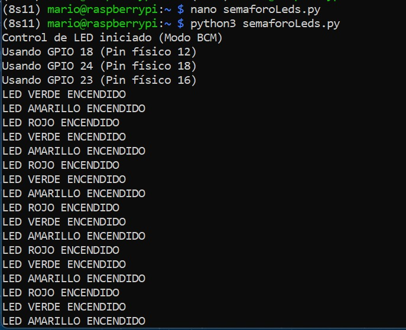
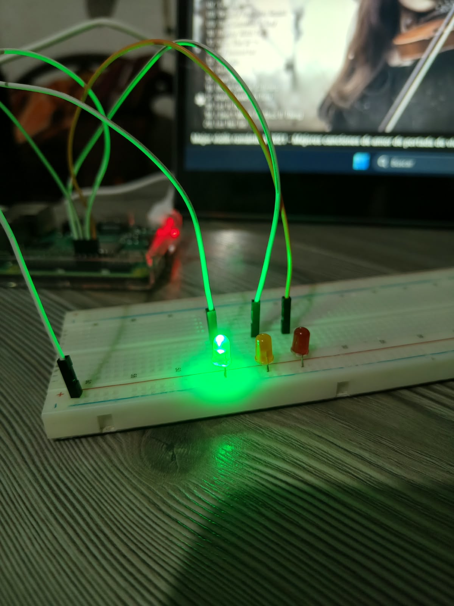
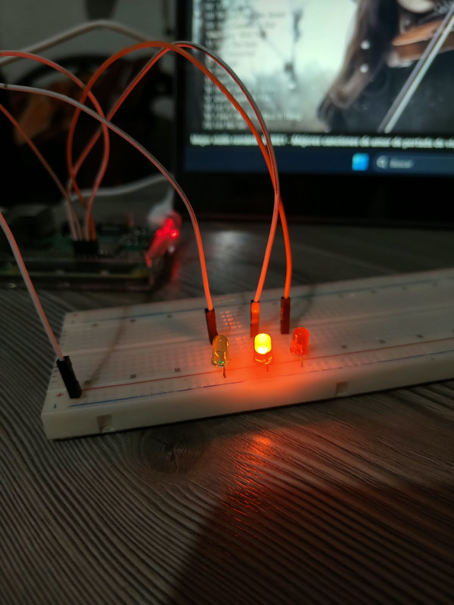
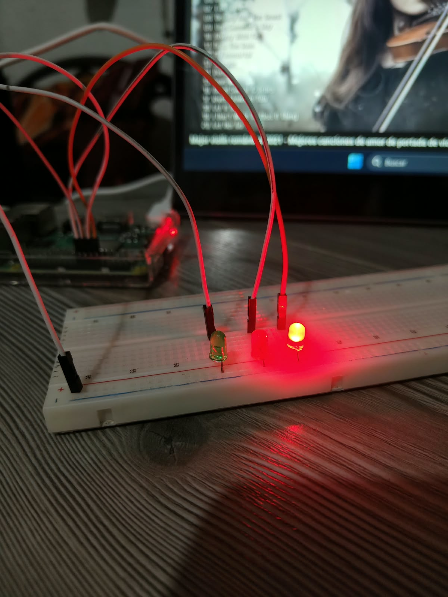

# P2 · Semáforo con LEDs en Raspberry Pi

> Práctica 2: simulación de un semáforo de tres colores controlando pines GPIO con Python, trabajando de forma remota por SSH.

---

## 📖 Descripción general

En esta práctica se armó un semáforo con tres LEDs (rojo, amarillo y verde) conectados a una Raspberry Pi. El programa enciende cada color por un tiempo determinado y repite la secuencia indefinidamente, igual que un semáforo real.

El trabajo se hizo a distancia: desde mi computadora con Windows abrí una sesión SSH hacia la Raspberry, activé un entorno virtual de Python, escribí el script con `nano` y lo ejecuté directamente en la placa.

---

## 🧰 Herramientas utilizadas

| Elemento | Detalle |
| :--- | :--- |
| Equipo de trabajo | Computadora con Windows (terminal con cliente SSH) |
| Dispositivo remoto | Raspberry Pi con sistema Linux |
| Lenguaje | Python 3 |
| Librería | `RPi.GPIO` |
| Entorno | Entorno virtual de Python (`8S11`) |
| Comunicación | SSH sobre red local |
| Editor | `nano` |

---

## 🔌 Conexión del circuito

Se utilizó la numeración **BCM**. Cada LED va conectado a su propio pin de salida:

| LED | GPIO (BCM) | Pin en la placa | Modo |
| :--- | :--- | :--- | :--- |
| 🔴 Rojo | GPIO 18 | Pin 12 | Salida |
| 🟡 Amarillo | GPIO 24 | Pin 18 | Salida |
| 🟢 Verde | GPIO 23 | Pin 16 | Salida |

---

## 🗂️ Estructura del repositorio

```text
P2_SemaforoLeds/
├── semaforoLeds.py
├── README.md
└── images/
    ├── terminal.jpeg
    ├── nano.jpeg
    ├── 1.jpeg
    ├── 2.jpeg
    └── 3.jpeg
```

---

## ▶️ Cómo reproducir la práctica

**1. Entrar a la Raspberry Pi por SSH**

```bash
ssh mario@192.168.137.160
```

**2. Activar el entorno virtual**

```bash
source 8S11/bin/activate
```

> Cuando está activo, el prompt muestra `(8S11)` al inicio de la línea.

**3. Crear y ejecutar el script**

```bash
nano semaforoLeds.py
python semaforoLeds.py
```

Para detener el programa se presiona `Ctrl + C`.

---

## 🧠 ¿Cómo funciona el programa?

1. **Preparación:** se importan `RPi.GPIO` y `time`, y se guardan en variables los pines de cada color.
2. **Configuración:** se selecciona el modo BCM, se declaran los tres pines como salida y se dejan en `LOW` para que todo inicie apagado.
3. **Ciclo principal (`while True`):** la secuencia se repite sin fin:

   | Orden | LED | Tiempo encendido |
   | :---: | :--- | :---: |
   | 1 | 🟢 Verde | 10 s |
   | 2 | 🟡 Amarillo | 3 s |
   | 3 | 🔴 Rojo | 10 s |

4. **Salida controlada:** un `try / except KeyboardInterrupt` detecta el `Ctrl + C` y rompe el ciclo sin mostrar errores.
5. **Limpieza:** el bloque `finally` ejecuta `GPIO.cleanup()` para liberar los pines y que ningún LED quede encendido al terminar.

---

## 🖼️ Evidencias

### Entorno y código

Activación del entorno virtual y ejecución del script en la terminal:



Edición del código en `nano`:


Durante la ejecución la consola muestra la secuencia `LED VERDE`, `LED AMARILLO` y `LED ROJO`. Al presionar `Ctrl + C` el programa se detiene y limpia los pines.

### Semáforo funcionando







---

## ✅ Conclusiones

Con esta práctica se logró controlar varias salidas GPIO de forma coordinada para reproducir el comportamiento de un semáforo, se reforzó el uso de entornos virtuales en la Raspberry y se confirmó la importancia de liberar los pines con `GPIO.cleanup()` al finalizar.
